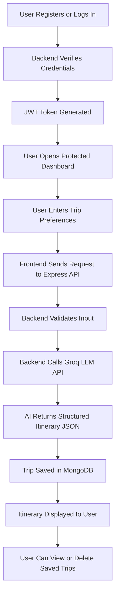
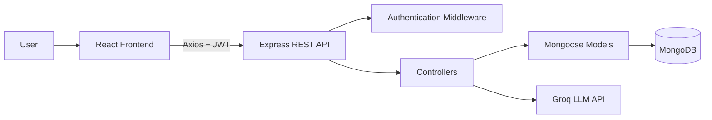
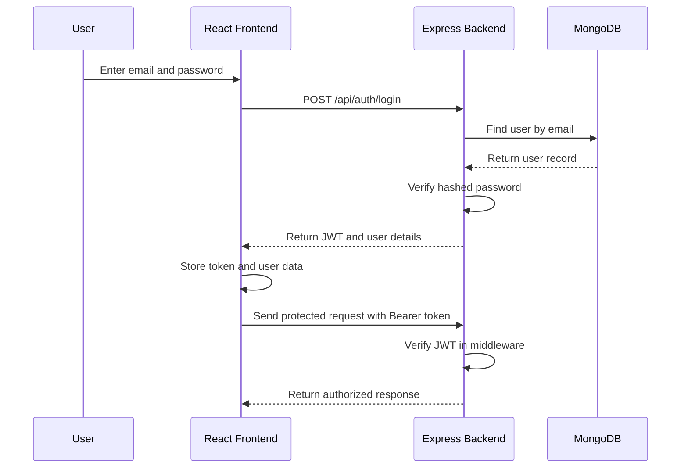
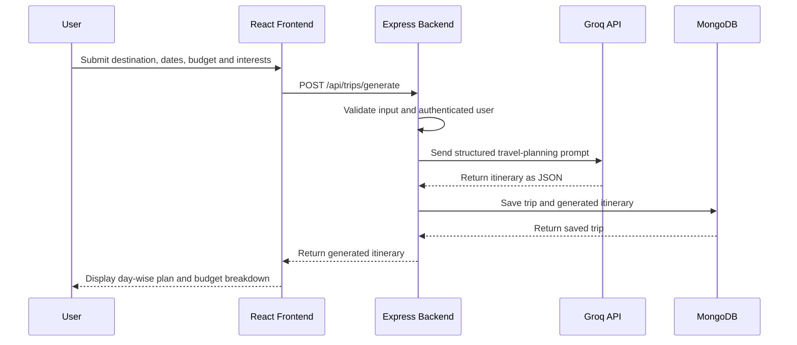

# AI-Based Travel Itinerary Planner

AI-Based Travel Itinerary Planner is a full-stack travel planning application built with the MERN stack. It uses the Groq LLM API to generate 
personalized, destination-specific, day-wise travel itineraries based on the user’s destination, travel dates, budget, travel type, and interests.

The application also provides secure user authentication, protected routes, trip history management, budget breakdowns, cost-saving suggestions, and user-specific access to saved itineraries.

---

## 🌐 Live Demo

👉 https://ai-based-travel-itinerary.vercel.app/

## 📂 GitHub Repository

👉 https://github.com/Gorityalamanasa/ai-based-travel

---

## Highlights

- AI-generated day-wise travel itineraries
- Destination-specific places and recommendations
- Budget-aware planning with Low, Medium, and Luxury categories
- Personalized plans based on travel type and interests
- Secure JWT authentication and password hashing
- User-specific itinerary history
- Protected frontend and backend routes
- Budget breakdown for stay, food, transport, and activities
- Search, view, and delete saved trips
- Input validation and centralized error handling

---

## Tech Stack

### Frontend

- React.js
- React Router DOM
- Axios
- HTML5 and CSS
- Create React App

### Backend

- Node.js
- Express.js
- MongoDB
- Mongoose
- JSON Web Token
- bcryptjs
- Axios
- CORS
- dotenv

### AI Integration

- Groq LLM API
- Llama 3.3 70B Versatile model

---

## Core Features

### 1. Secure Authentication

Users can register and log in using their email and password. Passwords are hashed with bcrypt before being stored in MongoDB. After successful authentication, the backend generates a JWT that is sent with protected API requests.

### 2. Personalized AI Itinerary Generation

The user provides:

- Destination
- Start and end dates
- Budget
- Budget category
- Travel type
- Interests

The backend sends these inputs to the Groq LLM API, which returns a structured JSON itinerary containing:

- Day-wise plans
- Morning, afternoon, and evening activities
- Real destination-specific places
- Food recommendations
- Estimated daily expenses
- Budget breakdown
- Cost-saving suggestions
- Destination-specific travel tips

### 3. Budget-Aware Recommendations

The AI adapts recommendations according to the selected budget category:

- **Low:** hostels, public transport, affordable food, and free attractions
- **Medium:** moderately priced hotels, local restaurants, and standard paid attractions
- **Luxury:** premium hotels, fine dining, private transport, and exclusive experiences

### 4. Saved Itinerary Management

Authenticated users can:

- Generate a new itinerary
- View all saved itineraries
- Search itineraries by destination
- Open a detailed itinerary
- Delete an itinerary

Each user can access only their own saved trips.

### 5. Dashboard

The dashboard displays:

- Total trips planned
- Number of unique destinations
- Total planned budget
- Searchable saved itinerary cards

---

## Application Workflow



---

## Project Architecture



---

## Folder Structure

```text
Ai-based travel/
├── backend/
│   ├── config/
│   │   └── db.js
│   ├── controllers/
│   │   ├── authController.js
│   │   └── tripController.js
│   ├── middleware/
│   │   └── authMiddleware.js
│   ├── models/
│   │   ├── Trip.js
│   │   └── User.js
│   ├── routes/
│   │   ├── authRoutes.js
│   │   └── tripRoutes.js
│   ├── utils/
│   │   └── aiService.js
│   ├── .env
│   ├── package.json
│   └── server.js
│
├── frontend/
│   ├── public/
│   └── src/
│       ├── components/
│       ├── context/
│       ├── css/
│       ├── pages/
│       ├── services/
│       ├── App.js
│       └── index.js
│
└── README.md
```

---

## REST API Endpoints

### Authentication

| Method | Endpoint | Access | Description |
|---|---|---|---|
| POST | `/api/auth/register` | Public | Register a new user |
| POST | `/api/auth/login` | Public | Authenticate user and return JWT |

### Trips

| Method | Endpoint | Access | Description |
|---|---|---|---|
| POST | `/api/trips/generate` | Private | Generate and save an AI itinerary |
| GET | `/api/trips` | Private | Get all trips belonging to the logged-in user |
| GET | `/api/trips/:id` | Private | Get one user-owned itinerary |
| DELETE | `/api/trips/:id` | Private | Delete one user-owned itinerary |

### Health Check

| Method | Endpoint | Access | Description |
|---|---|---|---|
| GET | `/api/health` | Public | Verify that the backend API is running |

---

## Environment Variables

Create a `.env` file inside the `backend` directory:

```env
PORT=5000
MONGODB_URI=your_mongodb_connection_string
JWT_SECRET=your_strong_jwt_secret
GROQ_API_KEY=your_groq_api_key
FRONTEND_URL=http://localhost:3000
NODE_ENV=development
```

> Never commit real API keys, database credentials, or JWT secrets to GitHub.

---

## Local Setup

### Prerequisites

Install the following:

- Node.js 18 or later
- npm
- MongoDB Atlas account or local MongoDB
- Groq API key

### 1. Clone the repository

```bash
git clone <your-repository-url>
cd "Ai-based travel"
```

### 2. Install backend dependencies

```bash
cd backend
npm install
```

### 3. Configure backend environment variables

Create `backend/.env` and add the required values shown above.

### 4. Start the backend

```bash
npm run dev
```

The backend runs at:

```text
http://localhost:5000
```

### 5. Install frontend dependencies

Open another terminal:

```bash
cd frontend
npm install
```

### 6. Start the frontend

```bash
npm start
```

The frontend runs at:

```text
http://localhost:3000
```

---

## Authentication Flow



---

## AI Generation Flow



---

## Data Security

- Passwords are hashed using bcryptjs.
- Protected APIs require a valid JWT.
- The authenticated user is loaded through middleware.
- Trip ownership is verified before viewing or deleting an itinerary.
- Sensitive credentials are stored in environment variables.
- CORS is restricted to configured frontend origins.

---

## Input Validation

The application validates:

- Required trip fields
- Positive budget values
- Valid date ranges
- Trip duration between 1 and 45 days
- Minimum password length
- Duplicate email registration
- User ownership of saved itineraries

---

## Screenshots

Add project screenshots to a `screenshots` folder and update the paths below.

```markdown


```

---

## Future Enhancements

- Export itinerary as PDF
- Add maps and location coordinates
- Add live weather information
- Add estimated travel time between attractions
- Support multiple currencies
- Add collaborative trip planning
- Add itinerary editing and regeneration
- Deploy frontend and backend to cloud platforms

---

## Resume Description

**AI-Based Travel Itinerary Planner — MERN, JWT, Groq LLM API**

- Developed a full-stack AI-powered travel itinerary planner using the MERN stack, enabling users to securely generate and manage personalized travel plans.
- Integrated the Groq LLM API to generate day-wise, destination-specific itineraries based on user preferences, budget, travel type, and trip duration.
- Implemented JWT authentication, protected routes, user-specific itinerary history, input validation, and secure trip ownership checks.

---

## Interview Explanation

> WanderPlan AI is a MERN-based travel planning application that generates personalized travel itineraries using the Groq LLM API. A user registers or logs in, and the backend generates a JWT for protected requests. The user provides trip details such as destination, dates, budget, travel type, and interests. The Express backend validates the request, sends a structured prompt to Groq, receives a JSON itinerary, and stores it in MongoDB under the authenticated user. Users can then view, search, and delete only their own saved itineraries.

---

## Author

**Gorityala Manasa**

- BMS Institute of Technology and Management

---

## License

This project is intended for learning, portfolio, and academic demonstration purposes.
